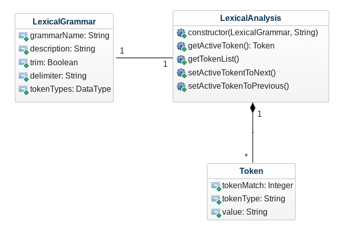
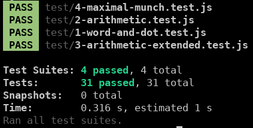

# Mall för inlämning laboration 1, 1dv610

## Checklista
  - [x] I min tokeniserare finns inga tokentyper eller reg-exp. Dessa finns i mitt testprojekt eftersom de skapas utav användaren.
  - [x] Jag har skrivit all kod och reflektioner själv. Jag har inte använt mig av andras kod för att lösa uppgiften.
  - [x] Mina testresultat är skrivna utifrån utförd testning ( och inte teoretiskt, det bör fungera :) )
  - [x] De enda statiska metoder eller funktioner utanför klasser som jag har är för att starta upp min testapplikation ex main(java).
  - [x] De enda bibliotek och färdiga klasser som används är sådana som måste användas (eller som används för att testa modulen).

## Egenskattning och mål

  - [] Jag är inte klar eftersom jag vet att jag saknar något. Då skall du inte lämna in!
  - [x] Jag eftersträvar med denna inlämning godkänt betyg (E-D)
  - [x] De flesta testfall fungerar
  - [x] Koden är förberedd på Återanvändning
  - [x] All kod samt historik finns i git 
  - [x] Kodkvaliterskraven är ifyllda
  - [x] Reflektion är skriven
  - [x] Jag eftersträvar med denna inlämning högre betyg (C-B) och anser mig uppfylla alla extra krav för detta. 
  - [x] Samtliga testfall är skrivna
  - [x] Egna testfall för Maximal munch och kantfall
  - [x] Testfall är automatiserade
  - [x] Det finns en tydlig beskrivning i hur modulen skall användas (i git)
  - [x] Kodkvalitetskraven är varierade 
  - [x] Jag eftersträvar med denna inlämning högsta betyg (A) 

Förtydligande: Examinator kommer sätta betyg oberoende på vad ni anser. 

## Återanvändning
<!---
Beskriv hur du anpassat din kod och instruktioner för att någon annan programmerare skall kunna använda din tokenizer. Om du skrivit instruktioner för din användare länka till dessa. Om inte beskriv här hur någon skall göra för att använda din kod med sin egen grammatik. 
--->

Min lösning baseras på att grammatik komponeras i form av JSON filer som användare enkelt kan skapa själva. Man initierar ett objekt (```LexicalGrammar```) för den grammatik som man vill utföra en lexikal analys med. 
Sedan skickar man med den lexikala grammatiken och strängen som ska analyseras till en initierad objekt av ```LexicalAnalysis```.  
Instruktioner i form av markdown filer (README) finns för både hur man använder modulen och komponerar egna grammatik som användare:   

- [Lexical Analysis README](./README.md)  
- [Lexical Grammar README](./src/lib/lexical-grammar/README.md)  

## Beskrivning av min kod
<!---
Beskriv din kod på en hög abstraktionsnivå. En kort beskrivning av dina viktigaste klasser och metoder. Skapa gärna ett klassdiagram som bild. 
--->



```LexicalAnalysis``` är huvudklassen för modulen. Den tar en ```LexicalGrammar``` initierad objekt (grammatiken) och en sträng som ska analyseras som argument. 
När ett objekt av ```LexicalAnalysis``` instantieras med giltiga argument så hanteras den första substrängen. 
Om substrängen inte är giltig kastas ett undantag. Annars skapas en ny token (med ```Token``` klassen) och läggs till i listan av skapade tokens (som tillhandahålls av ```LexicalAnalysis```). 
Med en instantierad ```LexicalAnalysis``` objekt så kan man kalla på metoderna ```setActiveTokenToPrevious()``` och ```setActiveTokenToNext()```. Dessa metoder pekar den aktiva token till respektive sekvens i tokenlistan. Med ```setActiveTokenToNext()``` så hanteras nästa substräng och ny token skapas om inte en nästa redan finns i tokenlistan.  
```getActiveToken()``` returnerar den nuvarande aktiva token och ```getTokenList()``` returnerar en lista över skapade tokens.  


## Hur jag testat

Koden har kontinuerligt testats med automatiserade tester genom test-ramverket Jest och via en enkel node.js applikation som baseras på instruktionerna i [README.md](./README.md) som kommer med modulen.  
Tester har skrivits för testfallen som är specifierade i uppgiftsbeskrivningen samt tester för de utökade aritmetiska och Maximum Munch grammatiker. Testfall har skrivits för kantfall som t.ex om man försöker flytta pekaren för aktiva token efter den sista (END) (kastar undantag).  
Jag har skrivit en liten "helper" metod för testerna som automatiskt flyttar sekvens utifrån en sträng som t.ex ">><>".  
Testerna hjälpte mig längs hela vägen att verifiera så att refaktoreringarna som gjordes under arbetets gång inte bröt funktionalitet.  



### Testfall
Lista de enskilda testfallen. **Fetmarkera** sådant som du själv fyllt i. En rad per testfall.
| Namn                                                                   | Grammatik         | Sträng           | Sekvens | Förväntat Aktivt Token                                | PASS/FAIL |
| ---------------------------------------------------------------------- | ----------------- | ---------------- | ------- | ----------------------------------------------------- | --------- |
| Test case 1.1: Get active token should match token type WORD.          | wordAndDotGrammar | 'a'              | \-      | { tokenMatch: 0, tokenType: 'WORD', value: 'a' }      | PASS      |
| Test case 1.2: Get next active token should match token type WORD.     | wordAndDotGrammar | 'a aa'           | \>      | { tokenMatch: 1, tokenType: 'WORD', value: 'aa' }     | PASS      |
| Test case 1.3: Get next active token should match token type DOT.      | wordAndDotGrammar | 'a.b'            | \>      | { tokenMatch: 1, tokenType: 'DOT', value: '.' }       | PASS      |
| Test case 1.4: Token at sequence >> should match token type WORD.      | wordAndDotGrammar | 'a.b'            | »       | { tokenMatch: 2, tokenType: 'WORD', value: 'b' }      | PASS      |
| Test case 1.5: Token at sequence >> should match token type WORD.      | wordAndDotGrammar | 'aa. B'          | »       | { tokenMatch: 2, tokenType: 'WORD', value: 'b' }      | PASS      |
| Test case 1.6: Token at sequence >>< should match token type DOT.      | wordAndDotGrammar | 'a .b'           | \>><    | { tokenMatch: 1, tokenType: 'DOT', value: '.' }       | PASS      |
| Test case 1.7: Empty passed string should append END token.            | wordAndDotGrammar | ''               | \-      | { tokenMatch: 0, tokenType: 'END', value: 'END' }     | PASS      |
| Test case 1.8: String with only whitespace should append END token.    | wordAndDotGrammar | ' '              | \-      | { tokenMatch: 0, tokenType: 'END', value: 'END' }     | PASS      |
| Test case 1.9: After end of tokenized string should append END token.  | wordAndDotGrammar | 'a'              | \>      | { tokenMatch: 0, tokenType: 'END', value: 'END' }     | PASS      |
| Test case 1.10: Set active token before first token should throw Error | wordAndDotGrammar | 'a'              | <       | Exception: 'First token has been reached.'            | PASS      |
| Test case 1.11: Invalid token type should throw Error                  | wordAndDotGrammar | '!'              | \-      | Exception: 'No matches found for this substring.'     | PASS      |
| Test case 2.1: Integer should match token type NUMBER                  | arithmeticGrammar | '3'              | \-      | { tokenMatch: 0, tokenType: 'NUMBER', value: '3' }    | PASS      |
| Test case 2.2: Float should match token type NUMBER                    | arithmeticGrammar | '3.14'           | \-      | { tokenMatch: 0, tokenType: 'NUMBER', value: '3.14' } | PASS      |
| Test case 2.3: Token value \* should return token type MUL             | arithmeticGrammar | '3 + 54 \* 4'    | \>>>    | { tokenMatch: 3, tokenType: 'MUL', value: '\*' }      | PASS      |
| Test case 2.4: Invalid token type should throw Error                   | arithmeticGrammar | '3+5 # 4'        | \>>>    | Exception: 'No matches found for this substring.'     | PASS      |
| Test case 2.5: Token at sequence ><>>> should match token type ADD.    | arithmeticGrammar | '3.0+54.1 + 4.2' | \><>>>  | { tokenMatch: 3, tokenType: 'ADD', value: '+' }       | PASS      |

### Testfall för högre betyg

| Namn                                                                                             | Grammatik                 | Sträng                                                                                                           | Sekvens     | Förväntat Aktivt Token                                  | PASS/FAIL |
| ------------------------------------------------------------------------------------------------ | ------------------------- | ---------------------------------------------------------------------------------------------------------------- | ----------- | ------------------------------------------------------- | --------- |
| Test case 1.12: Set active token after END token should throw Error                              | wordAndDotGrammar         | 'Can we get behind END?'                                                                                         | \>>>>>      | Exception: 'Last token has been reached.'               | PASS      |
| Test case 3.1: Token value - should match token type SUB.                                        | arithmeticExtendedGrammar | '60 - (18)'                                                                                                      | \>><><      | { tokenMatch: 1, tokenType: 'SUB', value: '-' }         | PASS      |
| Test case 3.2: Token value / should match token type DIV.                                        | arithmeticExtendedGrammar | '160 / 4.0 + 2'                                                                                                  | \>>><>><<<  | { tokenMatch: 1, tokenType: 'DIV', value: '/' }         | PASS      |
| Test case 3.3: Token value ( should match token type OPENPAREN.                                  | arithmeticExtendedGrammar | (58 + 8) - (8 \* 3)                                                                                              | \>>><>>><>> | { tokenMatch: 6, tokenType: 'OPENPAREN', value: '(' }   | PASS      |
| Test case 3.4: Token value ) should match token type CLOSEPAREN.                                 | arithmeticExtendedGrammar | '(89.5 + 45.5) / 3'                                                                                              | \>>>><>><   | { tokenMatch: 4, tokenType: 'CLOSEPAREN', value: ')' }  | PASS      |
| Test case 3.5: Grammar should be able to handle no whitespaces between substrings.               | arithmeticExtendedGrammar | '100-16/2'                                                                                                       | \>>>        | { tokenMatch: 3, tokenType: 'DIV', value: '/' }         | PASS      |
| Test case 3.6: Invalid token type should throw Error                                             | arithmeticExtendedGrammar | '42 / HEJ '                                                                                                      | \>>         | Exception: 'No matches found for this substring.'       | PASS      |
| Test case 3.7: After end of tokenized string should append END token.                            | arithmeticExtendedGrammar | '84/2'                                                                                                           | \>>>        | { tokenMatch: 3, tokenType: 'END', value: 'END' }       | PASS      |
| Test case 3.8: Set active token before first token should throw Error                            | arithmeticExtendedGrammar | '126/3'                                                                                                          | \><<        | Exception: 'First token has been reached.'              | PASS      |
| Test case 3.9: Set active token after END token should throw Error                               | arithmeticExtendedGrammar | '45-3.0/2'                                                                                                       | \>>>>>      | Exception: 'Last token has been reached.'               | PASS      |
| Test case 4.1: Should return the longest match for substring 1.23                                | maximalMunchGrammar       | '1.23 + 40.77'                                                                                                   | \-          | { tokenMatch: 0, tokenType: 'FLOAT', value: '1.23' }    | PASS      |
| Test case 4.2: getlongestMatchFrom method should return the longest match from array of matches. | maximalMunchGrammar       | Array({ tokenMatch: 0, tokenType: 'INTEGER', value: '1' }, { tokenMatch: 0, tokenType: 'FLOAT', value: '1.23' }) | \-          | { tokenMatch: 0, tokenType: 'FLOAT', value: '1.23' }    | PASS      |
| Test case 4.3: Grammar should be able to handle Maximum Munch in string with no whitespaces.     | maximalMunchGrammar       | '1.131312+8-40.7237'                                                                                             | \>>>>       | { tokenMatch: 4, tokenType: 'FLOAT', value: '40.7237' } | PASS      |
| Test case 4.4: After end of tokenized string should append END token.                            | maximalMunchGrammar       | '43+9.323-32.8375'                                                                                               | \>>>>>      | { tokenMatch: 5, tokenType: 'END', value: 'END' }       | PASS      |
| Test case 4.5: Set active token after END token should throw Error                               | maximalMunchGrammar       | '34.54-6.0'                                                                                                      | \>>>>       | Exception: 'Last token has been reached.'               | PASS      |

## Kodkvalitetskrav

Jag har få publika metoder pga inkapsling och för att modulen ska vara enkelt för slutanvändare att använda sig av. Riktlinjer ur kapitlena har jag i bästa mån försökt att få till så att de genomsyrar hela projektet.  

### Namngivning

```LexicalAnalysis``` [Länk](https://github.com/perrawd/1dv610-lab1-tokenizer/blob/master/src/lexical-analysis.js)  
Denna klass hette ursprungligen Tokenizer men ändrades slutligen till LexicalAnalysis. 
Anledningen till detta är att Lexical Analysis ger en tydligare beskrivning av vad klassen faktiskt gör och för vilket sammanhang. 
Tokenization är ett begrepp som kan användas i andra områden (används även i bl.a datasäkerhet). Jag anser att ändringen tillför mindre chans till att namnet eventuellt kan missuppfattas för något som används i andra syften (**"Avoid Disinformation"**) och säger så mycket mer vad den gör så fort man läser det.  
Tokenizer lät även likt namn som Processor, Manager som man inte bör använda för en klass (enligt **"Class Names"**).  
Det finns även en klass i denna modul som heter Token, jag tyckte att Tokenizer blev alldeles för likt det och hade gjort det svårare att skilja mellan dessa (enligt **"Make Meaningful Distinctions"**). 

```LexicalGrammar``` [Länk](https://github.com/perrawd/1dv610-lab1-tokenizer/blob/master/src/lib/lexical-grammar/lexical-grammar.js)  
Namnet för även denna klass är hämtad från problemdomänen (**"Use Problem Domain Names"**).
Klassen har tidigare namngivits ```GrammarType``` eller bara ```Grammar``` men jag tyckte att Lexical Grammar gav bäst tydlighet om att det handlar just om en grammatik i sammanhanget av en lexikal analys.  
Namnet gör att det känns konsekvent och följer temat som med LexicalAnalysis. Det går kanske att argumentera att dessa två namn kan vara väldigt lika (enligt **"Make Meaningful Distinctions"**) men jag tycker att orden analysis och grammar är så pass distinktiva och att både namnen inte är så pass långa så att det skulle vara svårt att urskilja de emellan. 

```setActiveTokenToPrevious()``` [Länk](https://github.com/perrawd/1dv610-lab1-tokenizer/blob/c5a0be4062dade6a2056d2c369b05d80aff51dcb/src/lexical-analysis.js#L201-L209) och ```setActiveTokenToNext()``` [Länk](https://github.com/perrawd/1dv610-lab1-tokenizer/blob/c5a0be4062dade6a2056d2c369b05d80aff51dcb/src/lexical-analysis.js#L238-L247)  
Metoderna hette initialt ```getPrevious``` och ```getNext```, för att sedan ändras till ```getPreviousToken``` och ```getNextToken``` för ökad tydlighet. När jag ändrade namn för dessa metoder så fann jag dels att dessa inte bara returnerar data som namnen antyder utan även muterar (hanterar och sätter nästa/föregående aktiva token). Alltså gör dessa flera saker fastän namnen inte reflekterade det.  
Jag valde att bryta ut delarna som returnerade data och döpte om dessa slutligen till ```setActiveTokenToPrevious()``` och ```setActiveTokenToNext()``` som tydligt påpekar vad de gör (**"Use Intention Revealing Names"**). 

```getActiveToken()``` [Länk](https://github.com/perrawd/1dv610-lab1-tokenizer/blob/c5a0be4062dade6a2056d2c369b05d80aff51dcb/src/lexical-analysis.js#L281-L283)  
Denna metod returnerar den aktiva token i den lexikala analysen. Namngivningen är enkel med ett verb som prefix (```get```) och den data som returneras (```ActiveToken```) (enligt **"Method Names"**) och säger precis vad den gör (**"Use Intention Revealing Names"**). 

### Funktioner

```OBS: "_" prefix för metoder innebär att dessa är semi-privata i Javascript```

```_processNextToken()``` [Länk](https://github.com/perrawd/1dv610-lab1-tokenizer/blob/c5a0be4062dade6a2056d2c369b05d80aff51dcb/src/lexical-analysis.js#L37-L45)  
Den första metoden i klassen ```LexicalAnalysis```. Jag försöker att lägga vikt på en topp-till-botten berättande (**"Reading Code from Top to Bottom: The Stepdown Rule"**) med **TO** paragrafer (**"Do One Thing"**). Block utrycken är endast är en rad långa (**"Blocks and Indenting"**) vilket gör metoden liten (**"Small!"**).
Dessa regler har jag försökt i bästa mån att applicera i princip alla metoder i modulen. 

```_matchTokenTypesTo(subString)``` (och andra monadiska metoder) [Länk](https://github.com/perrawd/1dv610-lab1-tokenizer/blob/c5a0be4062dade6a2056d2c369b05d80aff51dcb/src/lexical-analysis.js#L167-L175)    
Argumentet är indata (**"Common Monadic Forms"**). För dessa metoder har jag försökt att döpa så att man läser metodnamnen tillsammans med parametern som skickas in. Det ger tydlighet i namnet och vad metoden ska göra. Det blir väldigt läsbart när man använder metoderna i andra platser i koden och det utöker den flytande läsbarheten. (**"Use Descriptive Names"**)

```setActiveTokenToPrevious()``` [Länk](https://github.com/perrawd/1dv610-lab1-tokenizer/blob/c5a0be4062dade6a2056d2c369b05d80aff51dcb/src/lexical-analysis.js#L201-L209) och ```setActiveTokenToNext()``` [Länk](https://github.com/perrawd/1dv610-lab1-tokenizer/blob/c5a0be4062dade6a2056d2c369b05d80aff51dcb/src/lexical-analysis.js#L238-L247)  
Dessa metoder innehåller några steg för att utföra en sak men stegen ligger endast en abstraktionsnivå under (**"One Level Of Abstraction per Function"**).
Samt så jag bröt ut bröt ut kod till enskilda metoder (exempelvis ```_setActiveToken()```) för att undvika att repetera koden i både metoderna (**"Don't Repeat Yourself"**).

```processAndTokenizeNextSubString()``` [Länk](https://github.com/perrawd/1dv610-lab1-tokenizer/blob/c5a0be4062dade6a2056d2c369b05d80aff51dcb/src/lexical-analysis.js#L105-L117)  
Här hade jag verkligen svårt att bryta ned metoden i både namngivning och så att den bara gör "en sak". 
Metoden hette ursprungligen bara tokenizeSubString, men samtidigt så insåg jag att jag även hanterar substrängen. Jag funderade på att döpa om det till "processNextSubString" men samtidigt så returnerar jag en token ifrån metoden, då fann jag att namngivningen inte beskrev vad metoden faktiskt gör.  
Metoden bryter olyckligtvis mot både **"Command Query Separation"** och **"Do one Thing"**.  
Denna sekvens hade behövt ske förr eller senare i denna lösning. Skulle jag ta ut delarna som hanterar substrängen så hade de hamnat i en annan metod och likadan situation skulle uppstå även där. Det hade troligtvis gått att lösa detta men det skulle förmodligen inneburit att jag hade behövt skriva om sekvenserna i stora delar av modulen vilket jag tyvärr inte hann med. 
Att det blev en temporär koppling (temporal coupling), så tyckte jag i detta fall att jag behövde använda mig av ett namn som säger att metoden gör både sakerna (enligt slutet av **"Have no side effects"**) trots att det bryter mot vissa riktlinjer. 

## Laborationsreflektion

Att ha läst kapitlena i boken och arbetat med denna uppgift var omvälvande i hur jag ser på att kod bör skrivas.  
Trots att jag sedan tidigare har använt mig av vissa principer i kapitlena när jag har känt att det har varit bekvämt att göra det, så tycker jag nu att jag bör konstant applicera dessa när jag arbetar på ett projekt. Detta då jag nu inser att det som jag kanske inte tyckte var en så stor sak faktiskt bidrar till en större bild. Att någon annan kan få läsa och underhålla koden efter mig eller även förståelsen av koden för min egen del framöver. Att få ha läst om principerna i boken och vad de medför, konkretiserade och upplyste betydelsen av att alltid försöka applicera dessa. 

Vissa riktlinjer känns som uppenbarelser (som t.ex **Use searchable names** och **Use Pronouncable Names**) och det förklaras även i boken varför man bör följa dessa. Det får mig att fundera på varför man inte har tänkt på dessa tidigare. 
Andra koncept som exempelvis förklaras i avsnittet **Blocks and Indentations** är också en sådan sak som jag tror förbättrar och förenklar läsbarheten flera gånger om. Att läsa nästlade och komplicerade kodblock är aldrig trevligt, nu känner man att det finns ett bra sätt att "lösa" det.  
Vissa saker känns nästan självklara (exempelvis **Pick One Word Per Concept**) och andra som känns mer utmanande (**Do One Thing**). För de som det känns mer utmanande så tror jag att man behöver få in en vana med och öva vidare på. 

Jag har sen tidigare haft en ovana att använda otydliga short-hand funktioner och så ofta som möjligt ha korta namngivningar. Men under uppgiftens gång har jag insett att betydelsen av att vara tydligare i koden (**"clarity is king"**) och ha längre namngivningar (**"Don't be afraid to make a name long"**) väger tyngre mot det sättet som jag har arbetat med tidigare. 

Jag märkte medan jag döpte om och refaktorerade kod att man verkligen insåg vad koden gör. Om funktioner gör en eller flera saker, om namn verkligen antyder på vad det representerar eller inte (**"Use Intention Revealing Names"**).
Det har tagit tid och varit utmanande att refaktorera och döpa om saker i sin kod, en stor omställning från hur man har arbetat tidigare. Men resultaten har varit givande.

Det jag främt tar med mig ifrån att ha arbetat med denna uppgift och läst kapitlena är att det går att skriva en berättande kod (**The Stepdown Rule**) som är enklare att sätta sig in i och förstå vid första ögonblick. 

Jag hoppas slutligen att detta tar mig ett steg närmare till vad som beskrivs i sammanfattningen av kapitel 3: **Master programmers think of systems as stories to be told rather than programs to be written**.
